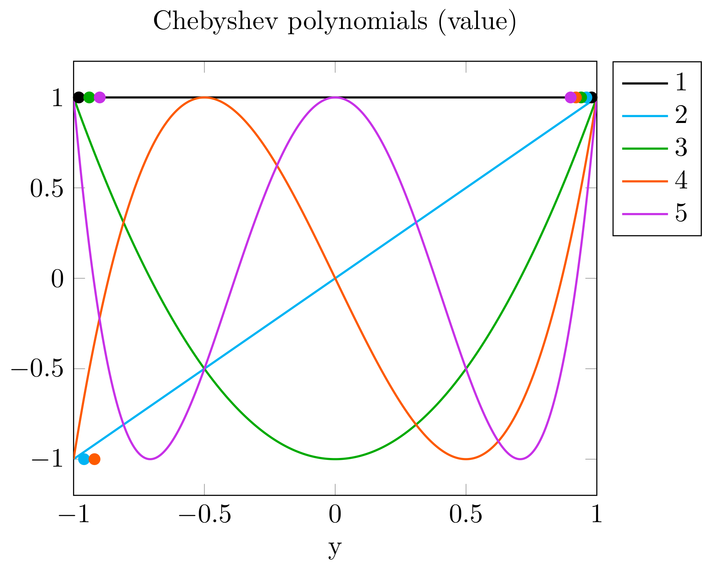
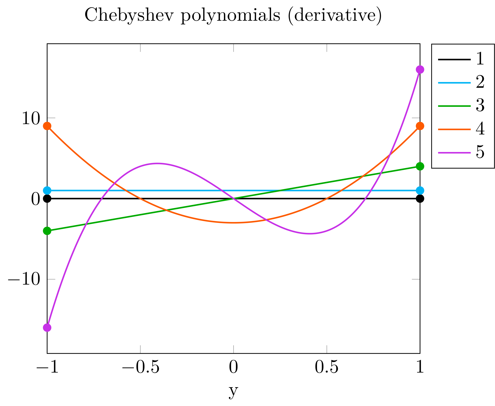
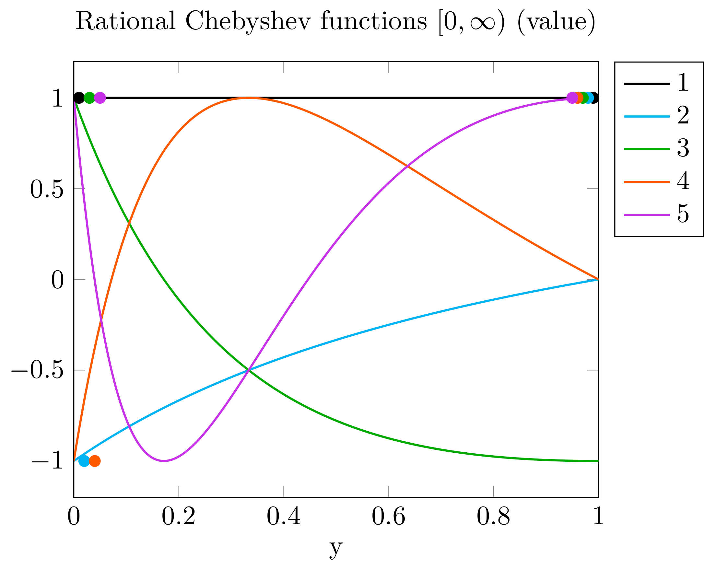
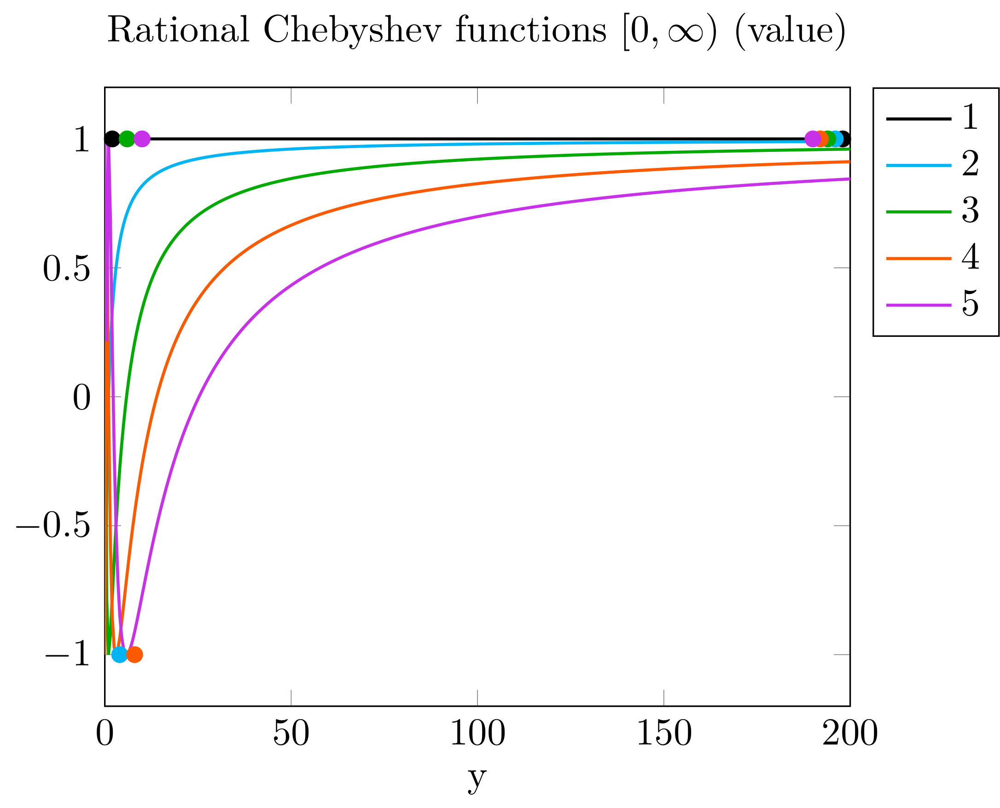
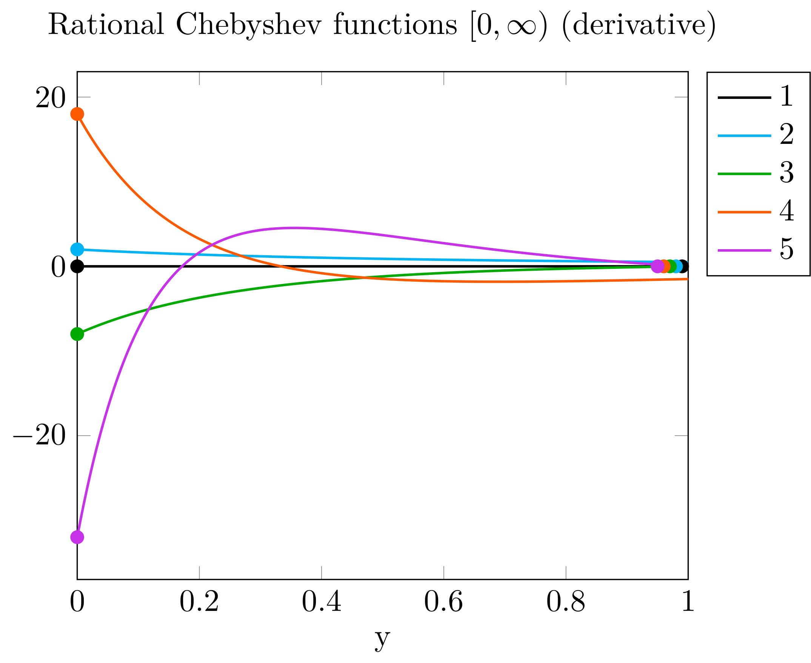
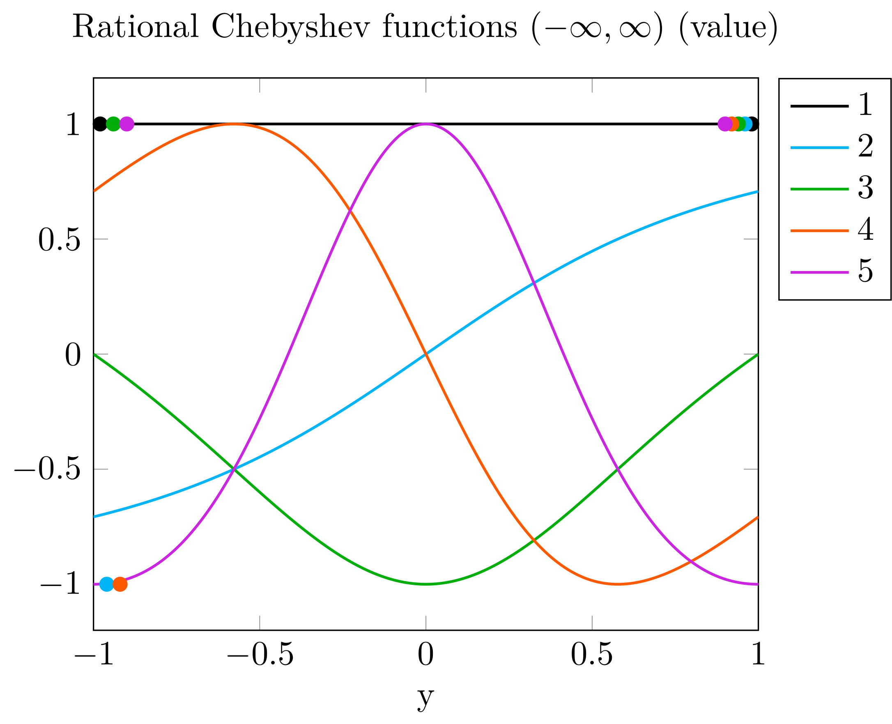
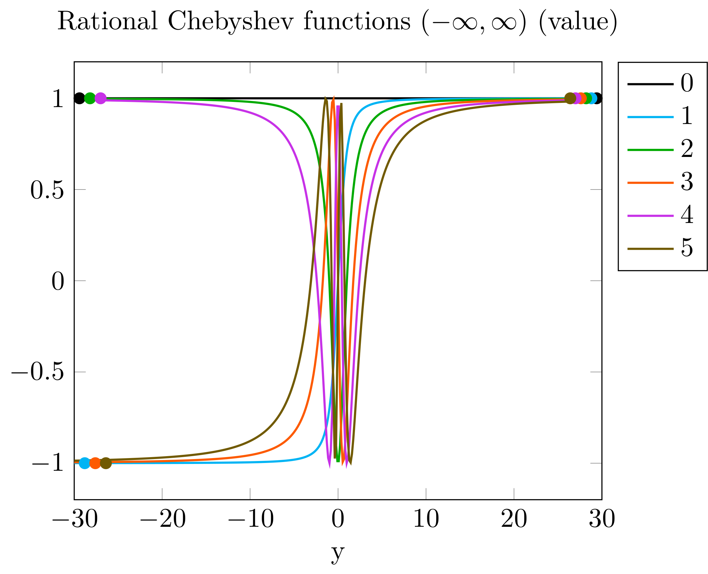
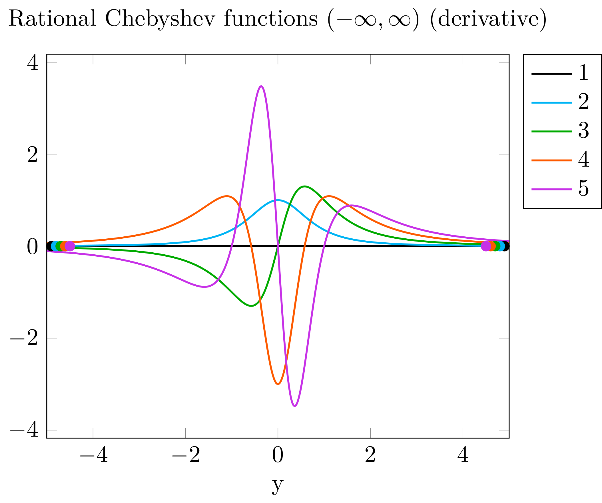

# SpectralKit.jl

<!--

 -->

Building blocks of spectral methods for Julia.

## Introduction

Mostly useful for algorithms along the lines of

> Boyd, John P. *Chebyshev and Fourier spectral methods*. 2001.

The aim is to provide simple, well-tested, robust, and fast *building blocks* for spectral algorithms, which can be easily combined into algorithms.

At the moment, the package API is experimental and subject to change.

## Pretty pictures

Some examples generated this library. **Circles mark values at the limit, shifted horizontally when this is needed to avoid overlap**. Infinite limits shown at finite values, so of course they don't match (this is a visual check of continuity, naturally it is unit tested).

### Chebyshev polynomials and their derivatives

### Chebyshev rational functions on [0,∞)

Up close, you can see the oscillation.

Let's zoom out a bit to see convergence to 0 at ∞.

Derivatives die out faster.

### Chebyshev rational functions on (-∞,∞)

Up close, you can see the oscillation.

Let's zoom out a bit to see convergence at -∞ and ∞.

Derivatives die out slower than for the [0,∞) transformation.

